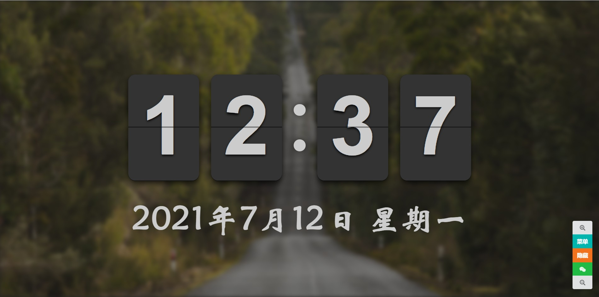
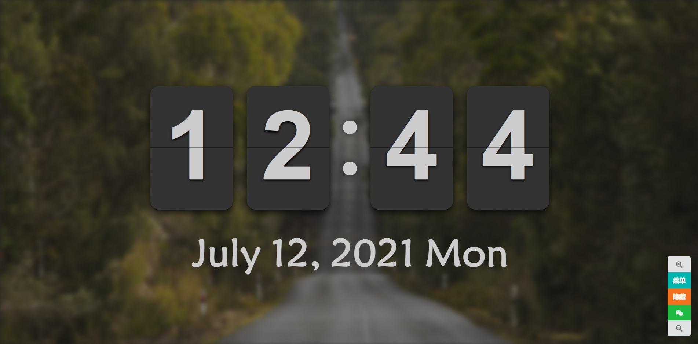
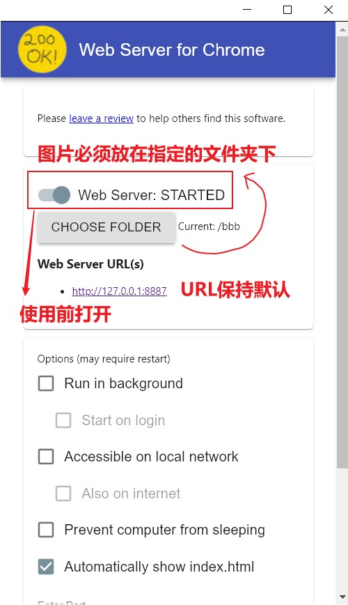

#  :thumbsup:链接:  [Github Pages](https://lxsamazing.github.io/flipclock-beautify)

# 简介

> ### 这是一个网页版的时钟桌面，简约风格。爱学习爱工作的你一定会喜欢它滴(●'◡'●)

# 特点

>- 支持背景图片显示与隐藏
>- 支持不同的时钟样式显示
>- 支持本地图片加载
>- 支持随机互联网超清图片及分辨率切换
>- 支持背景图片透明度及模糊调节
>- 支持字体设置
>- 支持时钟大小调节
>- 支持移动端设备访问

# 使用
<table><tr><td width="50px" class="alignRight">按键0: &nbsp &nbsp &nbsp &nbsp</td><td width="100px">背景图片显示与隐藏;</td></tr>
						 <tr><td class="alignRight">按键1 :&nbsp &nbsp &nbsp &nbsp</td><td>中外日期格式切换;</td></tr>
						 <tr><td class="alignRight">按键2 :&nbsp &nbsp &nbsp &nbsp</td><td>时制切换;</td></tr>
						 <tr><td class="alignRight">按键3 :&nbsp &nbsp &nbsp &nbsp</td><td>秒数显示与隐藏;</td></tr>
						 <tr><td class="alignRight">按键4 :&nbsp &nbsp &nbsp &nbsp</td><td>背景图片及其分辨率切换;</td></tr>
						 <tr><td class="alignRight">按键5 :&nbsp &nbsp &nbsp &nbsp</td><td>底部工具栏显示与隐藏;</td></tr>
						 <tr><td class="alignRight">按键. :&nbsp &nbsp &nbsp &nbsp</td><td>背景图片透明度设置;</td></tr>
						 <tr><td class="alignRight">按键+ :&nbsp &nbsp &nbsp &nbsp</td><td>时间显示区域放大;</td></tr>
						 <tr><td class="alignRight">按键- :&nbsp &nbsp &nbsp &nbsp</td><td>日期显示区域缩小;</td></tr>
						 <tr><td class="alignRight">按键6 :&nbsp &nbsp &nbsp &nbsp</td><td>自定义背景图片;</td></tr>
						 <tr><td class="alignRight">按键7 :&nbsp &nbsp &nbsp &nbsp</td><td>增大背景模糊;</td></tr>
						 <tr><td class="alignRight">按键8 :&nbsp &nbsp &nbsp &nbsp</td><td>减小背景模糊;</td></tr>
						 <tr><td class="alignRight">按键9 :&nbsp &nbsp &nbsp &nbsp</td><td>字体选择;</td></tr>
						 <tr><td class="alignRight">按键F5 :&nbsp &nbsp &nbsp &nbsp</td><td>网页刷新;</td></tr>
						 <tr><td class="alignRight">按键F11 :&nbsp &nbsp &nbsp &nbsp</td><td>网页全屏/网页退出全屏;</td></tr>
						 </table>

### 支持的浏览器(测试版本):
>- Google Chrome(91.0.4472.106)
>- Microsoft Edge(91.0.864.67)
>- Mozilla Firefox(不推荐)
>- 其它浏览器: 均未测试

> ### 注意:自定义背景图片之前,请务必打开Web Server for Chrome
> ### [下载地址](https://chrome.google.com/webstore/detail/web-server-for-chrome/ofhbbkphhbklhfoeikjpcbhemlocgigb/related)

# 参考

https://github.com/Zyjacya-In-love/flipclock-webpage

